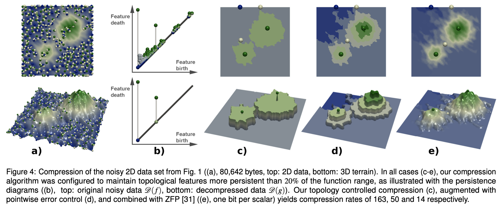

## OPTIMAL COMPRESSION LEVELS and THE HIGH-LUMINOSITY PHASE AT CERN

Via the derivations of results and rules within the domain of "Compressive Computing", under very general conditions, it is postulated that 70-80% of the bits used in modern numerical computations are irrelevant for the accuracy of the results. This theory also provides the mechanism to determine the number of bits that can be used to represent numbers without affecting the substance/information carried by the data into the end results.

Another point of emphasis is that, data movement is a considerable bottleneck. We have extremely fast systems that compute results faster than they can be stored or moved. We need techniques with an objective function of reducing the amount of data transfer.

Also, at a place such as CERN, with its CMS and ATLAS experiments, producing giant datastreams through an intricate system of sensors, we are running ML algorithms on FPGA level to reject data. Despite this aggressive filtering, we need more aggressive "Lossy Compression Algorithms" that do not lose any "physics" down the analysis pipeline. I know that we are interested in data lying Beyond the Standard Model (BSM), and previously unseen data must be retained in its originality. The compression algorithm must preserve this valuable data to the highest possible precision allowed by the physical devices in the pipeline.

To define an optimal compression limit in the use-cases of HEP at CERN, I would look to fulfill these criteria. :

* Pointwise error might not be a good metric, since the resolution of various instruments at different levels varies. So, to measure correctness, we can look into preserving "Higher Order Information" within the data distributions.

We are essentially, "teleporting" a collective essence of the data distribution for storage purposes and retrieving the core aspects via well-founded bases. When I think of the problem at hand, I think of the manifolds that are constructed by a given analysis method - in our case, a Neural Network acting on a given dataset. Such a manifold, in essence, would be a non-linear mapping from the datastream taken up for analysis (which we shall model as random variables). Now, I believe, the problem has been boiled down to preserving certain characteristic features of the manifold - including topology, invariance etc.
There is also an interesting body of research that uses ANNs (Neural Networks) as Manifold compressors. This aligns highly with my prior experience as a research intern where I studied Double-Framed Moduli spaces - existence of low-dimensional manifolds (what's "relevant") in high-dimensional spaces (raw, uncompressed data).

* Within this notion of preserving topological invariants within data, we can define a target threshold ( a form of an upper bound ) that tells to what extent and to what scale are the topological features preserved when we compress the data.

* Moreover, rather than using localized methods such as clustering to group similar datapoints, a Topological approach ensures preservation of the "global picture", which can be promising considering the manifold-inspired picture of viewing data distributions lying in higher dimensions.

In this regard, some resources I intend to study in greater detail are :  

[Topologically Controlled Lossy Compression](https://julien-tierny.github.io/stuff/papers/soler_pv18.pdf)   
[Lossy compression of General Random Variables](https://arxiv.org/abs/2111.12312)   
[Do Neural Networks Compress Manifolds Optimally?](https://arxiv.org/abs/2205.08518)   

